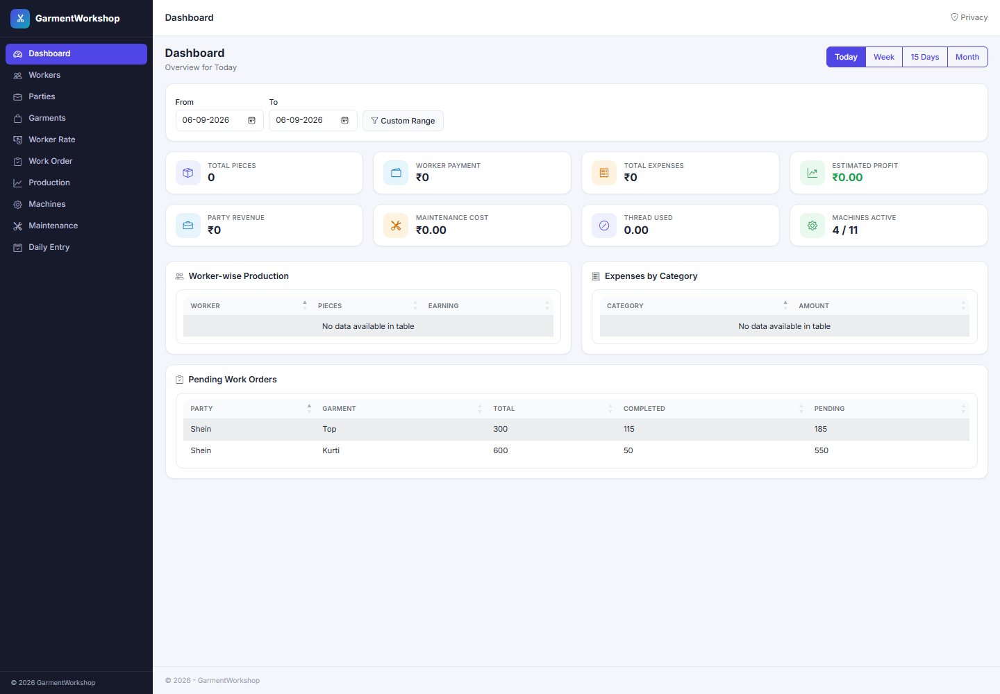
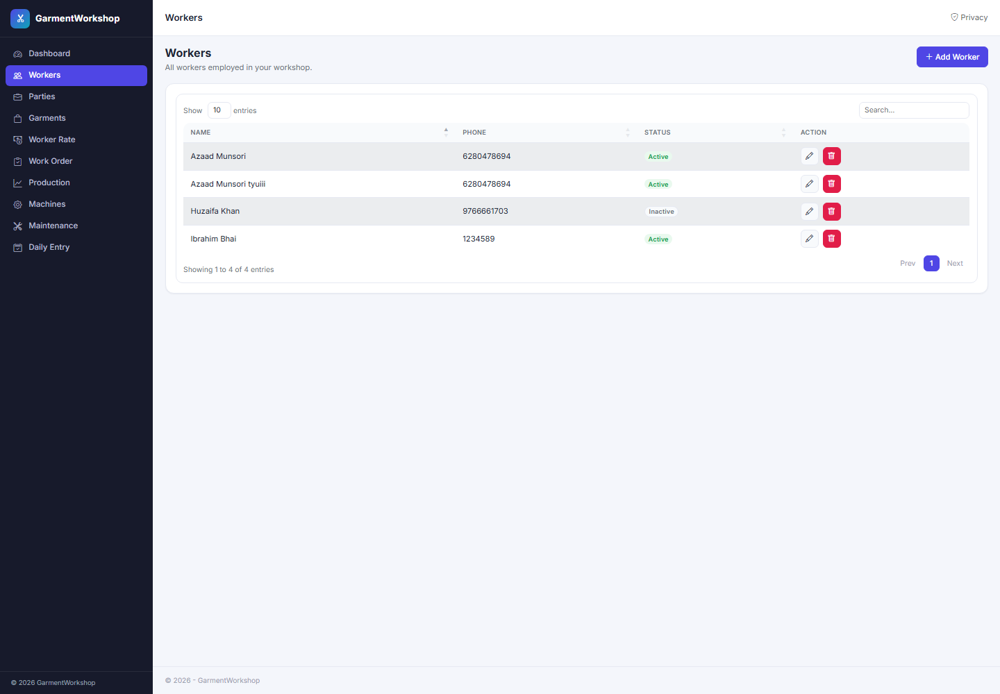

# GarmentWorkshop

A workshop management system for garment manufacturing units, built with **ASP.NET Core MVC**. It tracks everything a small garment workshop needs day to day — workers, parties (customers), garments, work orders, daily production, machines and their maintenance, thread stock, and expenses — and rolls it all up into a live dashboard.

## Features

- **Dashboard** — today/week/15-day/month (or custom date range) overview of pieces produced, worker payments, expenses, estimated profit, party revenue, maintenance cost, thread usage, and active machines, plus worker-wise production, expense-by-category, and pending work order breakdowns.
- **Workers** — manage the workforce, their contact details, and active/inactive status.
- **Worker Rates** — per-piece rates configured per worker and garment.
- **Parties** — the customers/businesses a workshop produces garments for.
- **Garments** — garment types/categories produced.
- **Work Orders** — orders placed by a party for a garment, with total pieces, party rate, timeline, and completion status.
- **Production** — daily production entries per worker against a work order, with automatic earning calculation.
- **Machines & Maintenance** — machine inventory and repair/servicing cost tracking.
- **Thread Stock** — thread color/type inventory with purchase and consumption tracking.
- **Expense Categories** — categorize and track workshop expenses.
- **Daily Entry** — a single quick-entry screen (tabbed) to log today's production, expenses, maintenance, and thread usage in one place.

## Tech Stack

- **ASP.NET Core MVC** (.NET 10)
- **Entity Framework Core** with SQL Server (Code First + Migrations)
- **Bootstrap 5** + **Bootstrap Icons** for the UI shell
- **DataTables** (jQuery) for searchable, sortable, paginated list views

## Getting Started

1. Update the connection string in `GarmentWorkshop/appsettings.json` (`ConnectionStrings:DefaultConnection`) to point at your SQL Server instance.
2. Apply migrations:
   ```
   dotnet ef database update --project GarmentWorkshop
   ```
3. Run the app:
   ```
   dotnet run --project GarmentWorkshop
   ```
4. Open the URL shown in the console (e.g. `https://localhost:7069`).

## Screenshots

**Dashboard** — live overview of production, payments, expenses, and pending work orders.



**Workers** — searchable, sortable list with quick edit/delete actions.


